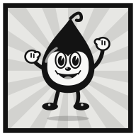
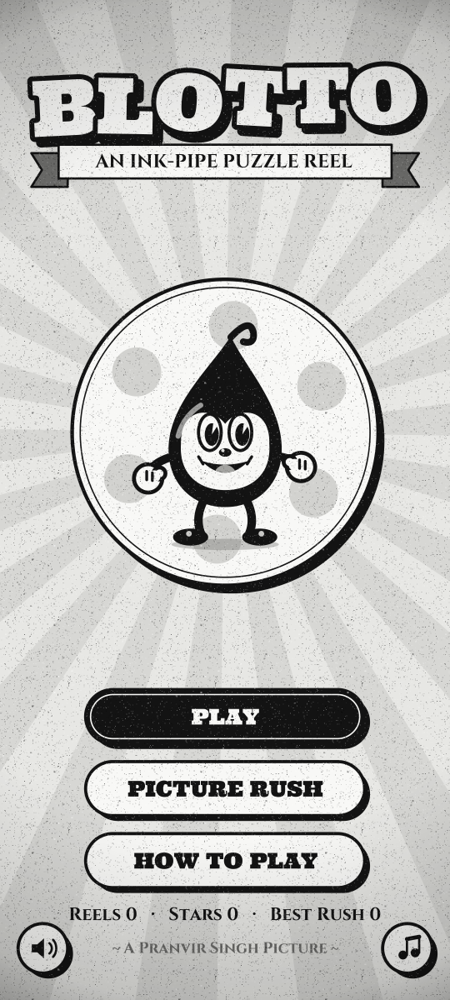
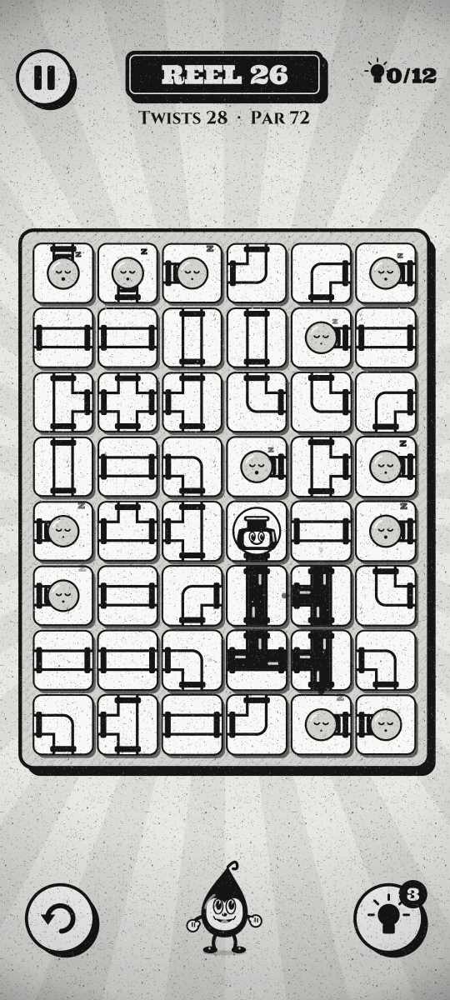
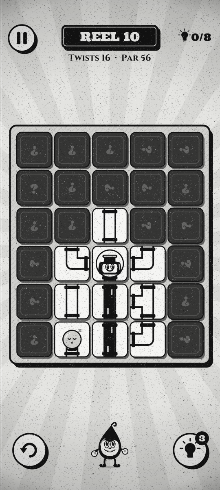
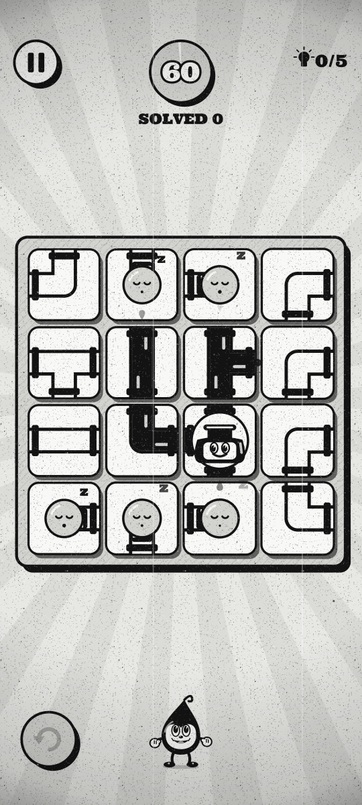

  

<h1 align="center">Blotto</h1>

  <b>An ink-pipe puzzle reel for Android, in the style of a 1930s cartoon.</b> 
  Twist the pipes, carry the ink from Blotto's inkwell to every sleepy lamp, and leave no loose ends.

  
  
  
  
  

  
  
  
  

## About

Blotto is written in Kotlin with **no game engine and no third-party libraries**. Every board is generated in code, all the art is drawn on an Android `Canvas`, and the music and sound effects are synthesised on the device. The whole game is a ~290 KB APK that needs **no permissions**: no internet, no ads, no tracking.

## How to play

- **Twist the pipes:** tap any pipe tile to give it a quarter turn.
- **Flow the ink:** carry the ink from Blotto's inkwell to every sleepy lamp.
- **Bolt it down:** sure of a pipe? Long-press to bolt it so it won't turn.
- **No loose ends:** every pipe end must meet another. Fewer twists earn more stars.

## Modes

### Story reels

Reels get bigger as you go, from a 3×3 board on the first reel to 8×11 from reel 100 on, and they never run out. Some reels change the rules:

| Reel | When | Twist |
|---|---|---|
| **The Negative** | Every 7th reel | The film is inverted: white is black, black is white |
| **Lights Out!** | Every 5th reel from reel 10 | The theatre is dark; you can only see tiles beside the ink |
| **The Midnight Negative** | When both land on the same reel | Inverted film and the lamps are out |

**Stars:** each reel is scored against its par (the twists needed to reach the intended solution). Finish close to par for 3 stars. Using hints caps the stars you can earn on that reel.

**Hints:** you start with 3 and can hold up to 9. Every 3-star reel earns one more. There is also an undo button.

### Picture Rush

A race against the clock. You start with 60 seconds, and every board you solve adds more time (the clock tops out at 99 seconds). Boards grow from 4×4 to 6×8 as your count climbs, and your best run is saved.

## The 1930s look

- **Old film on top of everything:** grain that changes at 24 fps, dust, hairs, scratches, a gentle flicker, gate weave, a vignette and the odd cue mark.
- **Cinema touches:** an iris wipe, a countdown leader before Picture Rush, title cards for each reel, an Intermission card when you pause and The End when the clock runs out.
- **Music and sound:** a synthesised score and sound effects. Sound and music can each be switched off, and your progress is saved on the device.

## Download

1. Open the [latest release](https://github.com/pranvirsingh/Blotto/releases/latest) and download the `.apk`.
2. Open it on your phone. Android will ask you to allow installing apps from that source the first time.
3. Requires Android 7.0 (API 24) or newer.

## Build from source

`build.sh` produces `build/Blotto.apk`. It needs:

- `aapt2`, `apksigner` and `d8.jar` (R8) from Android build-tools, plus `android.jar` for API 34
- the Kotlin compiler and standard library
- a JDK (for `java`, `jar` and `keytool`) and Python 3

The scripts expect the project at `/home/claude/blotto` and the toolchain in `/home/claude/tc` under specific jar names. Those paths are hardcoded in `build.sh`, `kc.sh` and in the tests (`Harness`, `Bot`, `AudioTest`, `IconGen`), and `Harness` and `Bot` also load the two fonts from the toolchain folder. The easiest way to build is to recreate that layout, which is what [`.github/workflows/ci.yml`](.github/workflows/ci.yml) does on Ubuntu (build-tools 34, Kotlin 2.3.10, JDK 17) before running the scripts unchanged. On first run, `build.sh` creates a local signing key, so a locally built APK is for testing. It can't update an installed release build.

## Tests

The tests run on a plain JVM against a small Java2D shim of `android.graphics`. There is no test script; [CI](.github/workflows/ci.yml) shows the exact commands. It compiles every game file except `MainActivity.kt` and `Audio.kt` together with `jvmtest/` using `kc.sh`, then runs:

- **PuzzleTestKt:** generates 8,950 boards (story reels 1 to 300, Picture Rush sizes and edge sizes). For each one it checks that the solution is valid, the board starts unsolved, solving in exactly par twists works, hints lead to a solve, a twist and its reverse cancel out, and saving and loading round-trips. For the 6,000 story boards it also checks that generation is deterministic.
- **AudioTestKt:** checks that every sound effect is loud enough to hear, and renders the music loop.
- **BotKt:** plays 45 story reels through the real UI with random pauses and restores, then Picture Rush, the back button, the how-to flow and the mute settings, checking the game state at every step.
- **HarnessKt monkey:** renders every screen to `shots/` (the screenshots above come from here), then runs 200,000 frames of random taps, drags, pauses and screen-size changes across 6 rounds.
- **IconGenKt** regenerates the launcher icons in `res/`. It isn't run in CI because it rewrites game resources.

## Project layout

| Path | What it is |
|---|---|
| `src/com/pranvir/blotto/Puzzle.kt` | Pure puzzle logic: board generator, solver checks, par, hints, reel specs |
| `src/com/pranvir/blotto/Game.kt` | Screens, input, scoring, hints, Picture Rush and saves |
| `src/com/pranvir/blotto/Art.kt` | All drawing: tiles, pipes, Blotto, lamps, cards and buttons |
| `src/com/pranvir/blotto/Film.kt` | The old-cinema layer: grain, dust, scratches, flicker, gate weave |
| `src/com/pranvir/blotto/Synth.kt`, `Audio.kt` | Synthesised music and sound effects, and playback |
| `src/com/pranvir/blotto/MainActivity.kt` | Android entry point: view, input, haptics, storage |
| `jvmtest/` | JVM test harness and the `android.graphics` shim |
| `build.sh`, `kc.sh`, `zipalign.py`, `rules.pro` | Build: resources, Kotlin compile, R8, packaging, signing |

See [CHANGELOG.md](CHANGELOG.md) for release history.

## License

Code: [MIT](LICENSE) © 2026 Pranvir Singh.

Fonts:

- **Ultra** (`assets/fonts/ultra.ttf`) © 2010 Brian J. Bonislawsky DBA Astigmatic (AOETI), licensed under the [Apache License 2.0](docs/licenses/Apache-2.0-Ultra.txt).
- **Cinzel** (`assets/fonts/cinzel.ttf`) © 2020 The Cinzel Project Authors, licensed under the [SIL Open Font License 1.1](docs/licenses/OFL-Cinzel.txt).
